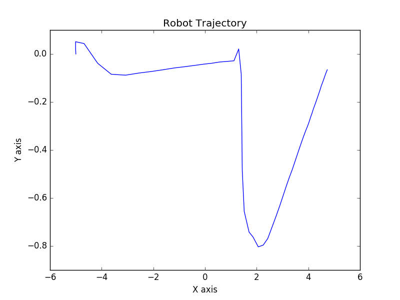

# Bug-controller

### To generate waypoints (x,y) used the following trajectory equation: 

```bash
 x = A cos(at)
 y = A sin(bt) 
 with A = 3, B = 3, a=1, b=2 
```

### Wrote a node that uses the waypoint generation code. Then used waypoints as target/goal point and the robots current location (from /odom) as start point. Calculated the following error terms:

```bash
Epos : Euclidean distance
Eθ : Difference between current heading and desired heading
```

### Plotted the robot trajectory (superimposed onto waypoints):


